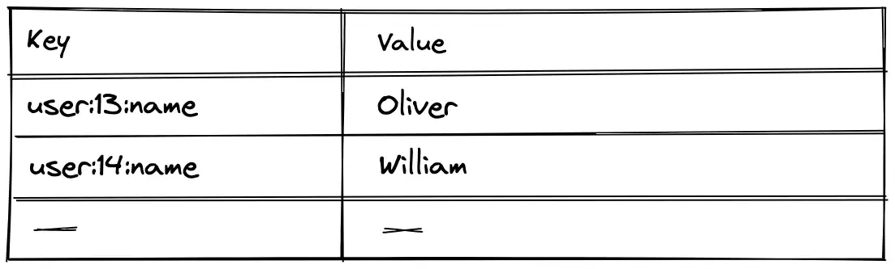

Introduction to Database.

These notes are summary of [https://sql-academy.org/](https://sql-academy.org/)

## Database

A database is a set of data stored in structured way. In fact, this is just a repository of some information, nothing more

## Database Management system

A database management system is a set of language and software tools that performs access to data, allows them to be created, modified and deleted, provides data security, etc.


## Database Types

### Relational Database

Relational databases are databases based on the relational model.

Data in relational structures is organized as a set of tables, called relationships, consisting of columns and rows. Each row of the table is a set of related values related to a single object or entity. Each row in a table can be labeled with a unique identifier called a primary key, and rows from multiple tables can be linked using foreign keys.

Example of Relational Database


#### Features of relational databases

- The data model in relational databases is defined in advance and is strictly typed
- Data is stored in tables consisting of columns and rows
- Only one value is allowed at the intersection of each column and row
- Each column is named and has a specific type, followed by values from all rows in this column
- The columns are arranged in a certain order, which is determined when creating the table
- There may not be a single row in the table, but there must be at least one column
- Queries to the database return the result in the form of tables

Examples of relational database: oracle, mysql, postgres, IBM db2, microsoft sql server

### Key-Value Database

Key-value databases are a type of databases that store data as a collection of key–value pairs in which the key serves as a unique identifier.



#### Advantages

- Speed of operation
- Simplicity of the data storage model
- Flexibility: values can be any, including JSON

#### Disadvantages

- Poorly scaled as data models become more complex
- Inefficiency when working with a group of records

Examples of Key-value database: Redis, memcached, etcd

### Document-Oriented Database

Document-oriented databases are a type of database designed to store and query data in the form of documents, similar to JSON.

Unlike other databases, document-oriented databases operate on "documents" grouped into collections. A document is a set of attributes (a key and its corresponding value). Values can be simple data types such as strings, numbers, or dates, as well as more complex types such as nested objects, arrays, and references to other documents.

Examples of Document based data storage


#### Features of Document Oriented Database

- No fixed data schema; records do not have a predefined structure.
- New information can be added to records without requiring all records to have the same structure.
- Documents are addressed using a unique key, often an automatically generated string.
- Document-oriented databases provide their own query language and have varying functionality, syntax, and performance, depending on the implementation.
- Searching can be more flexible than key-value databases due to the ability to query document content.

Example of query for mongodb

```mongodb
> db.users.find({"name": "Daniel"}).count()
> 1
```

## Structure of Relational Databases

Let's delve deeper into the structure and terminology of relational databases.

### Table Structure

In relational databases, information is stored in tables linked to each other. The tables themselves consist of:

- rows, which are called "records"
- columns, which are called "fields" or "attributes"


#### Most used Datatypes

- INT
- VARCHAR, NVARCHAR
- DATETIME
- DECIMAL, FLOAT
- BIT

To find out the data types of the attributes use `DESCRIBE` command

```sql
DESCRIBE <table_name>
```

Alternatively, you can look at the **ERD diagram** of the database schema:

### Primary Key

A key field (primary key) is a field (or set of fields) whose value uniquely identifies a record in the table.

### Foreign Key

A foreign key is a field (or set of fields) in one table that refers to the primary key in another table.


## Introduction to SQL

SQL is a structured query language that is used as an efficient way to store data, search for its parts, update, extract from the database, and delete.

Access to relational DBMS is made possible thanks to SQL. All major manipulations with databases are performed with it, some of them:

- Extract data from a database
- Insert records into the database
- Update records in the database
- Delete records from the database
- Create new databases
- Create new tables in the database
- Create stored procedures in the database
- Create views in the database
- Set permissions for tables, procedures, and views
